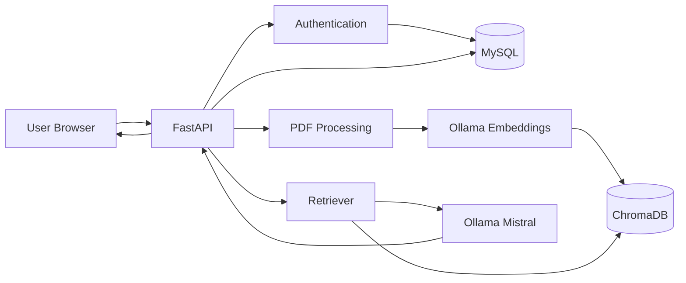
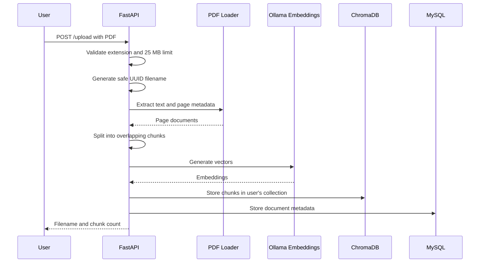
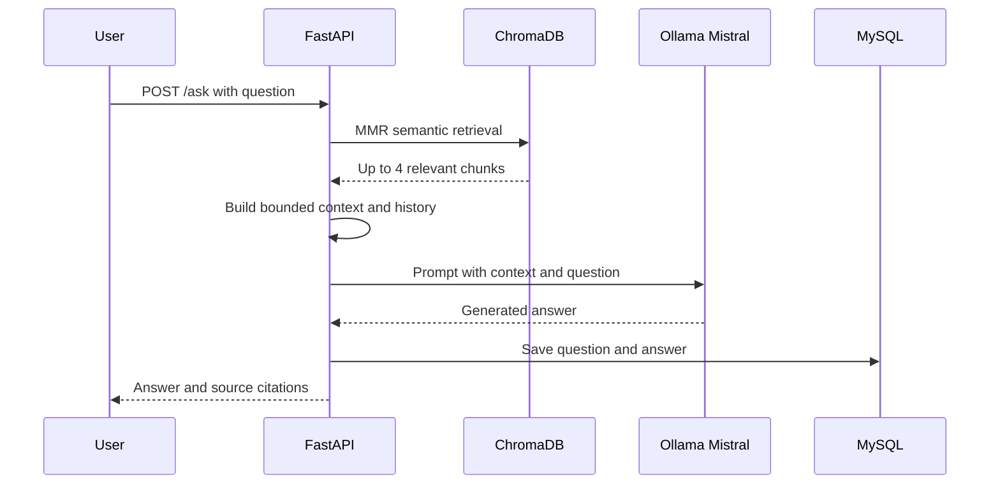

# KnowledgeHub AI: Interview Presentation Guide

This guide explains how to present KnowledgeHub AI clearly in a technical interview. Use it to understand the project and prepare your own explanation. Do not memorize every sentence; explain the decisions in your own words.

## 1. Thirty-Second Introduction

> KnowledgeHub AI is a multi-user document question-answering application built with FastAPI. Users can register, log in, upload PDF documents, and ask questions about their content. I built a retrieval-augmented generation pipeline using LangChain, ChromaDB, and local Ollama models. The system retrieves relevant PDF chunks before generating an answer and provides filename and page citations. When a question is unrelated to uploaded documents, the model can answer using general knowledge. MySQL stores users, document metadata, and chat history, while JWT authentication and per-user vector collections isolate each user's data.

## 2. Problem Statement

Reading long documents and manually finding specific information is slow. General-purpose chatbots can answer broad questions, but they do not automatically know a user's private documents and may produce unsupported answers.

KnowledgeHub AI addresses this by combining:

- Private PDF upload and indexing.
- Semantic search instead of keyword-only search.
- Local language-model inference through Ollama.
- Citations that identify the source file and page.
- General-knowledge fallback when no document contains the answer.
- Authentication and user-level data isolation.

## 3. Main Features

### Authentication

- User registration with name, email, and password.
- Email normalization and duplicate-account prevention.
- Password hashing with bcrypt.
- Login using an HTTP-only JWT cookie.
- Protected dashboard, upload, and question endpoints.
- Logout by deleting the authentication cookie.

### Document Processing

- Accepts PDF files up to 25 MB.
- Generates a safe server-side filename to prevent collisions and unsafe paths.
- Extracts text and page metadata with `PyPDFLoader`.
- Splits text into overlapping chunks.
- Creates embeddings with `nomic-embed-text` through Ollama.
- Stores vectors persistently in ChromaDB.
- Uses a separate Chroma collection for each user.

### Question Answering

- Retrieves semantically relevant chunks with Maximal Marginal Relevance.
- Builds a limited context window from retrieved chunks.
- Sends context, recent conversation history, and the question to Mistral.
- Returns an answer with document and page citations.
- Uses general knowledge when PDF context is unavailable or irrelevant.
- Stores completed questions and answers in MySQL.

## 4. Technology Stack

| Layer | Technology | Reason |
| --- | --- | --- |
| Backend | FastAPI | Type-aware APIs, dependency injection, validation, and automatic OpenAPI docs |
| Templates | Jinja2 | Simple server-rendered authentication and dashboard pages |
| Browser UI | Bootstrap, CSS, JavaScript | Responsive interface without a separate frontend build system |
| Relational data | MySQL | Persistent users, document metadata, and chat history |
| ORM | SQLAlchemy | Database sessions and Python model mapping |
| Authentication | JWT, HTTP-only cookie, bcrypt | Stateless identity token and secure password storage |
| LLM | Ollama with Mistral | Local inference without sending document text to a hosted model |
| Embeddings | Ollama with `nomic-embed-text` | Local semantic vector generation |
| RAG orchestration | LangChain | PDF loading, splitting, retrieval, and model integrations |
| Vector database | ChromaDB | Persistent semantic search with metadata support |

## 5. High-Level Architecture



The application uses two different storage systems because they solve different problems:

- MySQL stores structured relational records such as users and chat history.
- ChromaDB stores embedding vectors for semantic similarity search.
- The filesystem stores the original uploaded PDFs.

## 6. Repository Structure

```text
app/
|-- auth/
|   |-- routes.py       # Login, registration, logout
|   |-- schemas.py      # Request schema definitions
|   `-- security.py     # bcrypt, JWT, current-user dependency
|-- dashboard/
|   `-- routes.py       # Protected dashboard and summary data
|-- database/
|   |-- db.py           # SQLAlchemy engine and session dependency
|   `-- models.py       # User, Document, ChatHistory models
`-- rag/                # Target package for further RAG extraction

templates/              # Jinja2 HTML pages
static/                 # CSS and JavaScript
uploads/                # Original uploaded PDFs
chroma_db/               # Persistent vectors
main.py                  # FastAPI setup and current RAG endpoints
```

## 7. Authentication Flow

### Registration

1. The user submits name, email, password, and confirmation.
2. The server trims the name and normalizes the email to lowercase.
3. It validates email format and password length.
4. It queries MySQL to prevent duplicate email addresses.
5. bcrypt hashes the password with a generated salt.
6. The user record is inserted into `kai_users`.
7. The server creates a signed JWT containing the user ID and expiration.
8. The JWT is placed in an HTTP-only, SameSite cookie.
9. The browser is redirected to the protected dashboard.

### Login

1. The server retrieves a user by normalized email.
2. bcrypt compares the supplied password with the stored hash.
3. A successful login creates a new signed JWT cookie.
4. A failed login returns one generic message, avoiding disclosure of whether an email exists.

### Protected Requests

The `get_current_user` FastAPI dependency:

1. Reads the authentication cookie.
2. Verifies the JWT signature and expiration.
3. Extracts the user ID from the `sub` claim.
4. Loads the user from MySQL.
5. Returns HTTP 401 if any step fails.

This dependency protects both `/upload` and `/ask`, so direct API calls cannot bypass the dashboard.

## 8. PDF Ingestion Flow



### Chunking Decision

The splitter currently uses:

- Chunk size: 1,000 characters.
- Chunk overlap: 200 characters.

The overlap reduces information loss when an important sentence or concept crosses a chunk boundary. These values are practical defaults, but they should be evaluated against document type and retrieval quality.

### Metadata

Each chunk carries:

- Original source filename.
- One-based PDF page number.

This metadata is returned as a citation after retrieval.

## 9. Question-Answering Flow



### Retrieval Strategy

The retriever uses Maximal Marginal Relevance with:

- `k=4`: return up to four chunks.
- `fetch_k=10`: initially consider ten candidates.

MMR balances relevance and diversity. This helps avoid returning four nearly identical chunks from the same section.

### Context Control

Retrieved text is limited to approximately 4,000 characters before being placed in the prompt. This controls latency and prevents the context from growing without bounds.

### Conversation Context

The prompt includes the last three question-answer pairs from the active user's in-memory session history. The full completed answer is also persisted in MySQL.

### General-Knowledge Fallback

If retrieval returns no useful context, Mistral still receives the question. The prompt instructs it to begin the answer with `Based on general knowledge:` and not claim that the answer came from an uploaded document. The API returns an empty source list in this case.

## 10. User Data Isolation

Data isolation is implemented at several layers:

- Every document metadata row includes `user_id`.
- Every chat-history row includes `user_id`.
- Dashboard queries filter by the authenticated user's ID.
- ChromaDB uses a collection named for the user ID.
- Upload and ask routes require the authenticated user dependency.
- Uploaded files receive generated filenames rather than user-controlled storage paths.

This is important because authentication without query-level and vector-level isolation would still allow data leakage.

## 11. Security Decisions

### Implemented

- Passwords are bcrypt hashes, not reversible encryption.
- JWTs have an expiration time.
- JWTs are stored in HTTP-only cookies, so browser JavaScript cannot read them.
- SameSite cookies reduce cross-site request risk.
- Production can enable the cookie's `Secure` flag through configuration.
- Login failures use a generic message.
- Upload filenames are replaced with UUIDs.
- Upload size and file extension are validated.
- Internal exception details are logged instead of returned to API clients.
- Browser-rendered chat content is HTML-escaped.

### Production Improvements

- Add CSRF tokens to state-changing form and API requests.
- Validate PDF content signatures, not only filename extensions.
- Add login rate limiting and temporary account lockout.
- Rotate and securely manage secrets outside local `.env` files.
- Add malware scanning for uploaded files.
- Enforce HTTPS and `COOKIE_SECURE=true`.
- Add role-based authorization for administrative features.
- Track and revoke sessions using the existing session table.

Mentioning these improvements demonstrates that you understand the difference between a functional project and a production-hardened system.

## 12. Database Design

### `kai_users`

- User ID.
- Name and unique email.
- bcrypt password hash.
- Role and account status.
- Creation and update timestamps.

### `kai_documents`

- Document ID and owner ID.
- Safe stored filename and original display filename.
- MIME type and file size.
- Upload timestamp.

### `kai_chat_history`

- Chat record ID and owner ID.
- Question and generated answer.
- Creation timestamp.

In a future migration, explicit ORM foreign-key relationships and cascade behavior should be added to strengthen referential integrity.

## 13. Important Technical Decisions

### Why Local Ollama?

- Uploaded document text remains on the local machine.
- There is no external model API cost.
- Models can be changed without redesigning the application.
- The tradeoff is slower inference on CPU and local hardware requirements.

### Why RAG Instead of Fine-Tuning?

- Documents can be added without retraining a model.
- Citations can be attached to retrieved chunks.
- Updating knowledge means re-indexing documents, not training again.
- Fine-tuning is better for behavior or style changes, not frequently changing factual documents.

### Why ChromaDB?

- It integrates directly with LangChain.
- It persists vectors locally.
- It supports metadata and multiple collections.
- It is appropriate for a local prototype; a larger deployment might use pgvector, Qdrant, Weaviate, or another managed vector store.

### Why JWT in a Cookie?

- JWT provides signed, expiring identity data.
- An HTTP-only cookie is safer against token theft through browser JavaScript than local storage.
- The tradeoff is that cookie-based authentication requires deliberate CSRF protection in production.

### Why Server-Rendered Pages?

- Authentication and dashboard requirements are relatively compact.
- Jinja2 avoids the complexity of a separate frontend deployment.
- FastAPI still exposes JSON endpoints for upload and chat interactions.

## 14. Challenges and How to Explain Them

### Duplicate FastAPI Application Initialization

An earlier version initialized the FastAPI application twice. The second instance silently discarded the router attached to the first instance, causing the test route to return 404. The fix was to keep one application instance and attach every router to it.

**Lesson:** Framework application objects should have a single composition root, and route maps should be verified in tests.

### Password-Library Compatibility

Passlib was incompatible with the installed bcrypt release. The implementation was changed to call bcrypt directly while preserving compatibility with standard bcrypt hashes.

**Lesson:** Security dependencies require integration testing; successful installation does not guarantee runtime compatibility.

### Password in a Database URL

The MySQL password contained `@`, which has structural meaning in a URL. It had to be encoded as `%40` in `DATABASE_URL`.

**Lesson:** Connection strings are URLs, so reserved characters in credentials must be percent-encoded.

### Shared Application State

The first prototype used one global chat-history list and one shared vector collection. That could mix data between users. History keys and vector collections were changed to use the authenticated user ID.

**Lesson:** Adding login is not enough; every storage and retrieval path must enforce ownership.

### Local Model Performance

Mistral generation can exceed two minutes when running entirely on CPU.

**Possible improvements:**

- Use a GPU-supported Ollama installation.
- Select a smaller quantized model.
- Stream tokens to improve perceived latency.
- Add generation timeouts and cancellation.
- Reduce prompt length and output-token limits.

## 15. Testing Strategy

The current verification covers:

- Python compilation.
- FastAPI route registration.
- Anonymous dashboard redirects.
- User registration and duplicate prevention.
- HTTP-only authentication cookies.
- Authenticated dashboard access.
- Logout and protected API rejection.
- General-knowledge answers when retrieval returns no chunks.
- MySQL connectivity and schema compatibility.

Tests can use an isolated SQLite database and mocked vector/LLM components. Mocking keeps authentication and API tests fast and deterministic without waiting for Ollama.

### Testing Improvements

- Add permanent pytest test modules to the repository.
- Add PDF ingestion tests with a small fixture PDF.
- Test user-to-user vector isolation.
- Add malformed and encrypted PDF cases.
- Add browser tests for registration, upload, chat, and logout.
- Add database migration tests.
- Run tests automatically in CI.

## 16. Current Limitations

Be direct if an interviewer asks what is unfinished:

- The RAG endpoints remain in `main.py`; they should move into `app/rag` services and routes.
- There is no document deletion or vector cleanup workflow.
- Chat history is persisted, but previous conversations are not yet displayed in the dashboard.
- Retrieval does not currently apply a relevance-score threshold.
- The file check relies mainly on the `.pdf` extension and parser success.
- Database schema changes do not yet use Alembic migrations.
- Generation is synchronous and can be slow on CPU.
- There is no streaming response, job queue, rate limiting, or CSRF token.
- Automated tests have been executed as focused checks but should be committed as a full pytest suite.
- General knowledge is model knowledge and may be outdated or incorrect.

An honest limitations section usually makes a stronger impression than claiming the project is production-complete.

## 17. Future Roadmap

### Short Term

- Extract upload, retrieval, and generation logic into `app/rag` services.
- Add Alembic database migrations.
- Add document listing and deletion.
- Delete associated Chroma vectors when a document is removed.
- Add a committed pytest suite.
- Stream generated tokens to the chat interface.

### Medium Term

- Add retrieval scores and a configurable relevance threshold.
- Filter retrieval by document ID or selected collection.
- Add conversation threads and persisted conversational memory.
- Add background jobs for large PDF ingestion.
- Support DOCX, PPTX, and text files.
- Add admin usage and audit dashboards.

### Production Scale

- Run FastAPI behind a reverse proxy with HTTPS.
- Use object storage for uploaded documents.
- Move to a scalable vector service.
- Add Redis for rate limiting, caching, and jobs.
- Add monitoring, tracing, centralized logs, and alerting.
- Use secret management instead of local environment files.

## 18. Five-Minute Live Demo Script

### Minute 1: Explain the Problem

> This application lets each user build a private searchable knowledge base from PDF documents while retaining the ability to ask general questions.

Show the registration and login pages. Mention bcrypt and the HTTP-only JWT cookie.

### Minute 2: Show the Dashboard

Show:

- Signed-in user name.
- Document summary.
- Question count.
- Upload and chat areas.

Explain that dashboard queries and API endpoints are filtered by the authenticated user.

### Minute 3: Upload a PDF

Upload a small PDF and point out the returned chunk count.

Explain:

> The server extracts text page by page, keeps page metadata, splits text with overlap, embeds each chunk locally, and stores it in this user's Chroma collection.

### Minute 4: Ask a Document Question

Ask a question with an obvious answer in the PDF. Show the source filename and page.

Explain MMR retrieval and why citations are possible.

### Minute 5: Ask a General Question

Ask a question unrelated to the PDF. Show the `Based on general knowledge:` label and empty source list.

Finish with one limitation and one next step:

> The largest current constraint is CPU inference latency. My next improvements would be token streaming, relevance thresholds, and a permanent automated test suite.

## 19. Common Interview Questions and Answers

### What is RAG?

Retrieval-augmented generation retrieves relevant information from an external knowledge source and places it in the model prompt before generation. It gives the model current or private context without retraining it.

### What is an embedding?

An embedding is a numeric vector representing semantic meaning. Texts with similar meanings tend to have nearby vectors, allowing semantic similarity search even when they do not share exact keywords.

### Why use chunk overlap?

Without overlap, a concept split across two chunk boundaries may lose context. Overlap repeats a small amount of adjacent text so each chunk remains understandable.

### How do citations work?

The PDF loader records page metadata. That metadata stays attached during chunking and vector storage. After retrieval, the API returns each selected chunk's original filename and page number.

### How do you prevent one user from seeing another user's documents?

The authenticated user ID is applied to relational queries and determines the Chroma collection name. The protected endpoint derives this identity from the verified JWT rather than accepting a user ID from the browser.

### Why not trust a user ID sent by the frontend?

A client-controlled user ID can be changed. The server must derive identity from a verified authentication token and use that identity for authorization decisions.

### How do you reduce hallucination?

The prompt prioritizes retrieved context, limits claims to that context when the answer is present, requires explicit labeling for general knowledge, and returns citations. A stronger future version would add a relevance threshold and an abstain option.

### Why use both MySQL and ChromaDB?

MySQL is designed for structured relational records and constraints. ChromaDB is designed for vector similarity search. Using each for its strength is simpler than forcing all data into one storage model.

### Why is password hashing different from encryption?

Encryption is reversible with a key. Password hashing is intentionally one-way and uses a salt. During login, bcrypt verifies the candidate password against the stored hash without recovering the original password.

### What happens when a JWT expires?

JWT decoding fails because the expiration claim is invalid. The protected dependency returns HTTP 401, and the user must authenticate again.

### Is JWT logout truly server-side revocation?

The current logout removes the browser cookie. A copied token would remain valid until expiration. Stronger revocation could store session IDs or token identifiers in `kai_user_sessions` and invalidate them server-side.

### How would you scale document ingestion?

Move parsing and embedding to a background worker, store files in object storage, track processing status in MySQL, and notify or poll the frontend when indexing completes.

### How would you improve answer latency?

Use GPU inference or a smaller model, stream tokens, cache embeddings, reduce context size, run ingestion asynchronously, and set output-token limits.

### How would you evaluate retrieval quality?

Build a dataset of documents, questions, expected source pages, and answers. Measure retrieval recall at `k`, citation correctness, answer faithfulness, and response latency. Then tune chunking, embedding model, retrieval strategy, and thresholds.

### What would change for production?

Add migrations, CSRF protection, rate limiting, observability, object storage, asynchronous jobs, secret management, HTTPS, backup policies, automated tests, and a deployment pipeline.

## 20. Strong Closing Statement

> This project taught me that a useful AI application is more than calling a language model. The difficult parts are document processing, retrieval quality, authentication, data isolation, failure handling, persistence, and presenting evidence for generated answers. I built the application as a working local system and can clearly identify the engineering steps needed to make it production-ready.

## 21. Final Interview Checklist

Before the interview:

- Start MySQL and confirm the database connection.
- Start Ollama and run `ollama list`.
- Confirm `mistral` and `nomic-embed-text` are installed.
- Start FastAPI with `uvicorn main:app --reload`.
- Prepare one small, readable PDF.
- Prepare one document question and one general question.
- Test registration, login, upload, ask, and logout.
- Keep `/docs` available to show the API contract.
- Never display `.env` or real credentials during screen sharing.
- Be ready to discuss one technical challenge and one limitation honestly.
